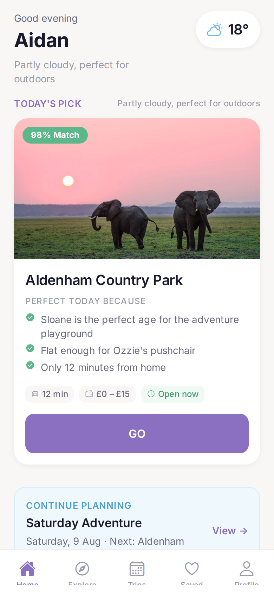
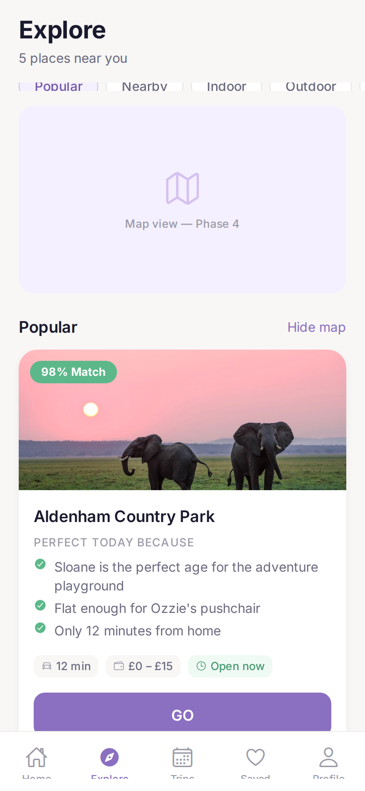
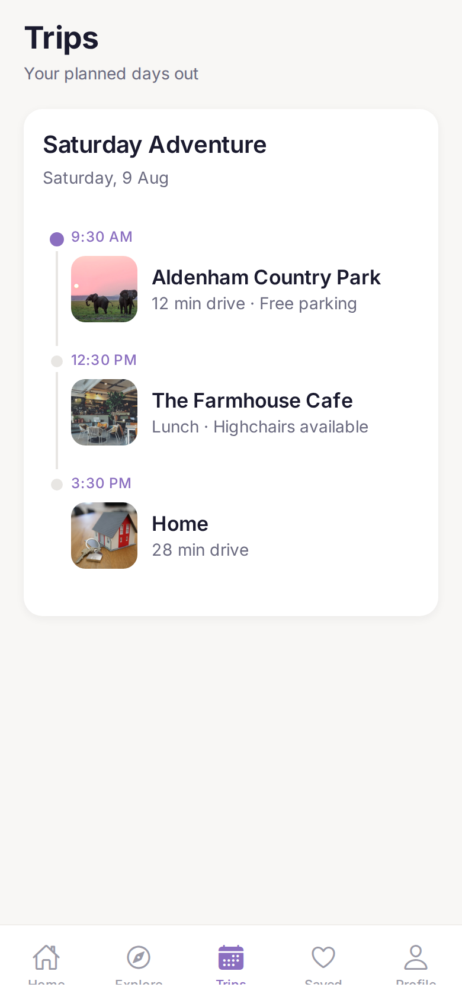
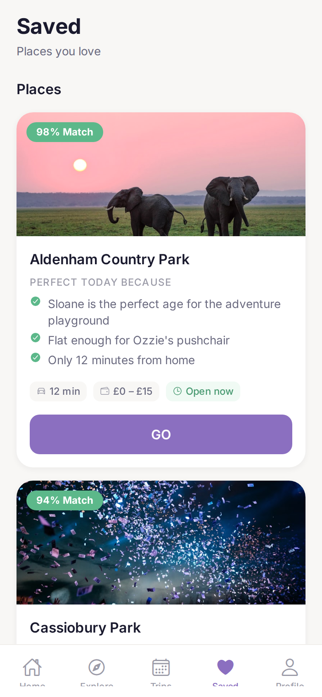
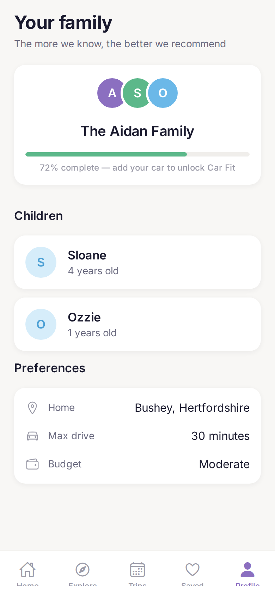
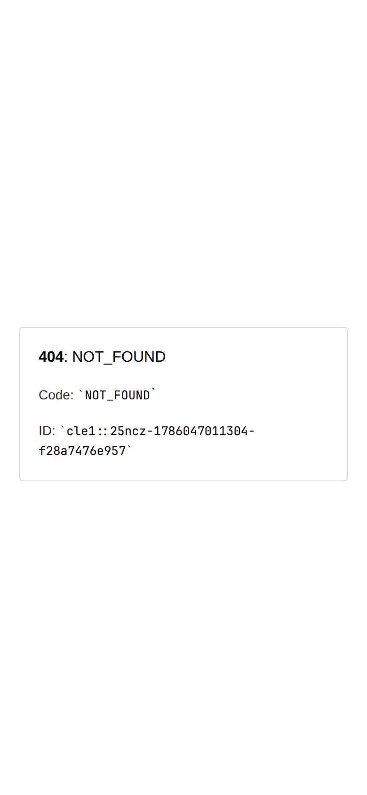
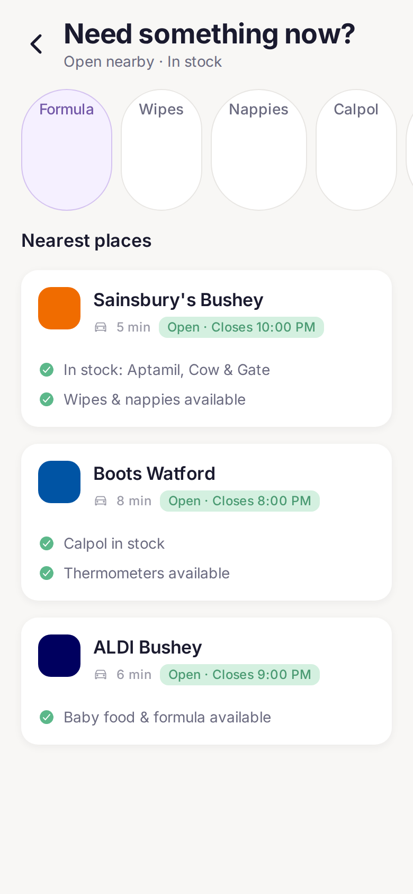
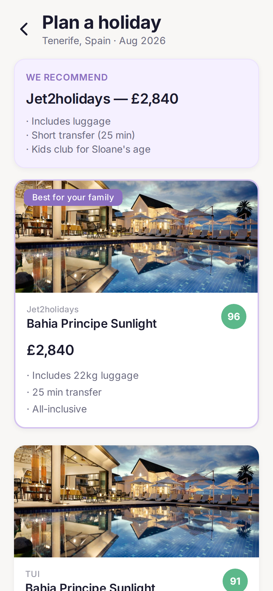
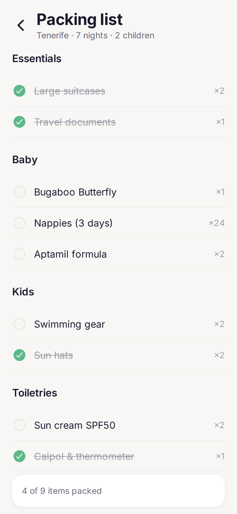
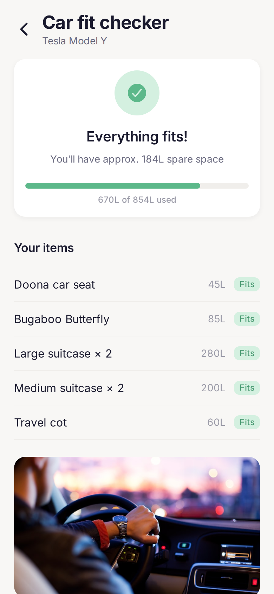

# FamilyPilot — Design Audit

**Date:** 6 August 2026  
**Auditors:** Senior product design review (Apple / Airbnb standard)  
**Method:** Manual navigation of all screens on deployed preview + mobile viewport screenshots  
**Preview URL:** https://family-pilot-seven.vercel.app/  
**Viewport:** iPhone 14 Pro (390×844), 2× scale  
**Scope:** Audit only — no changes made

---

## Executive Summary

FamilyPilot has **strong product thinking** and a **differentiated feature set** (Family Match™, Decision Cards, Car Fit, Need Now). The visual direction — soft purple, green trust signals, off-white backgrounds — is appropriate for a premium family consumer app.

However, the current build reads as a **high-quality MVP**, not an App Store feature candidate. The gap is not ideas; it is **systematic execution**: repetitive card patterns, a broken venue route on web, a visible “Phase 4” placeholder, and home-screen density that creates scroll fatigue rather than confidence.

**Overall score: 6.4 / 10** — functional and promising, needs focused polish before it feels trustworthy enough for daily family decisions.

> **Remediation update (6 Aug 2026):** Phase 2 remediation on branch `cursor/phase2-remediation-1a85` addresses P0–P2 audit items. See [PHASE_2_REMEDIATION.md](./PHASE_2_REMEDIATION.md) for completed changes. Original findings below are preserved unchanged.

> **Trust & polish update (7 Aug 2026):** Branch `cursor/trust-polish-pass-1ade` addresses trust, CTA clarity, Family Match presentation, Explore filters, and prototype-language removal. See [TRUST_AND_POLISH_PASS.md](./TRUST_AND_POLISH_PASS.md). Fresh screenshots: [design-review/](./design-review/).

---

## Audit Method

1. Navigated all 10 available screens on the live Vercel deployment
2. Captured full-page mobile screenshots (see [Screenshots](#screenshots))
3. Cross-referenced against design tokens and component code
4. Evaluated against Apple HIG and Airbnb listing-quality benchmarks

---

## Scores by Area

| Area | Score | Summary |
|------|-------|---------|
| **First impression** | 7/10 | Warm palette and personalised greeting land well; home screen length undermines clarity |
| **UI consistency** | 5.5/10 | Decision Cards unify list views, but utility screens diverge; match badges vary in format |
| **Navigation** | 8/10 | Five-tab IA is correct; stack screens need clearer back affordance on web |
| **Visual hierarchy** | 7/10 | Venue and Car Fit lead; Home competes with itself |
| **Typography** | 6.5/10 | Inter tokens exist but 8 variants feel similar; uppercase labels overused |
| **Colours** | 8/10 | Soft purple + green is distinctive and calm; tertiary text too faint in places |
| **Spacing** | 5.5/10 | Token system exists (4px grid) but vertical rhythm breaks on long scroll pages |
| **Touch targets** | 7/10 | GO buttons and tabs pass 44pt; filter chips and meta tags borderline |
| **Accessibility** | 6/10 | Labels on key buttons; contrast failures on captions; no Reduce Motion audit |
| **Empty states** | 4/10 | Components exist but rarely visible; Saved/Trips always populated in demo |
| **Loading states** | 4.5/10 | Skeleton on Home hero only; mock API resolves too fast to feel intentional |
| **Performance** | 8.5/10 | Fast load, smooth scroll; 2.9MB JS bundle is heavy for mobile web |
| **Trust** | 6/10 | Family Match builds trust; placeholder map, stock photos, and venue 404 erode it |
| **Overall polish** | 6/10 | Best screens (Venue, Car Fit) show potential; inconsistency elsewhere |

**Weighted overall: 6.4 / 10**

---

## Screenshots

Captured at 390×844 mobile viewport from production preview.

| Screen | Screenshot |
|--------|------------|
| Home |  |
| Explore |  |
| Trips |  |
| Saved |  |
| Profile |  |
| Venue detail |  |
| Need Now |  |
| Holiday |  |
| Packing |  |
| Car Fit |  |

> **Critical:** Venue detail screenshot is blank — `/venue/venue-1` returns **HTTP 404** on production. This is a deployment routing bug, not a design choice.

---

## Screen-by-Screen Review

### 1. Home `/`

**First impression:** Calm and personalised. Weather pill and “TODAY'S PICK” signal intelligence immediately.

| Strengths | Issues |
|-----------|--------|
| Greeting + weather context feels Apple Weather-adjacent | **Extremely long scroll** — 3 carousels + recent + quick actions = fatigue |
| Decision Card hero is compelling | Parent name (“Aidan”) not visible in greeting block at first glance |
| Continue Planning adds continuity | Same elephant stock photo repeated across cards breaks authenticity |
| Quick action grid is scannable | Eight actions still compete with recommendations — unclear priority |

**Score: 7/10**

**Recommendations:**
- Collapse to one recommendation row + “See all” instead of three full carousels
- Surface parent name in greeting: “Good afternoon, Aidan” as single line
- Vary photography or use category-specific imagery
- Pin “Today’s Pick” and hide secondary carousels behind “More ideas”

---

### 2. Explore `/explore`

**First impression:** Structured discovery, undermined by the map placeholder.

| Strengths | Issues |
|-----------|--------|
| Primary filters (Popular, Nearby, etc.) are the right set | **“Map view — Phase 4”** destroys trust — never ship internal labels |
| Filter sheet “More” pattern is correct | Map area consumes ~200px for non-functional content |
| Decision Cards in list are consistent | “5 places near you” subtitle low contrast |
| FlatList improves performance | Indoor filter with 5 total venues feels empty |

**Score: 5/10** — weakest tab screen

**Recommendations:**
- Remove map panel until real; replace with compact “List view” or collapsed teaser
- Show active filter with filled chip + result count animation
- Add subtle list/map toggle when map ships (Airbnb pattern)

---

### 3. Trips `/trips`

**First impression:** Clear timeline — practical, not delightful.

| Strengths | Issues |
|-----------|--------|
| Timeline dot for active stop | Timeline line weight too thin |
| Thumbnails add context | No “Today / This weekend” temporal badge |
| Single trip reads well | No edit, share, or “Start navigation” CTA |
| Card container is clean | Empty state not visible in demo (exists in code) |

**Score: 6.5/10**

**Recommendations:**
- Increase timeline visual weight (Airbnb Trips / TripIt reference)
- Add sticky summary: total drive time, estimated spend
- Primary CTA: “Start Saturday Adventure”

---

### 4. Saved `/saved`

**First impression:** Same Decision Cards as Home — consistent but redundant feeling.

| Strengths | Issues |
|-----------|--------|
| Grouped by “Places” | No search or sort |
| Match % + GO pattern consistent | Saved items indistinguishable from recommendations |
| Heart tab icon reinforces purpose | No “Saved 3 days ago” metadata |

**Score: 6/10**

**Recommendations:**
- Compact row variant for Saved (thumbnail + name + match) — reserve Decision Cards for discovery
- Add search bar
- Swipe-to-remove with undo toast

---

### 5. Profile `/profile`

**First impression:** Clean family hub — closest to Apple Health summary cards.

| Strengths | Issues |
|-----------|--------|
| Avatar cluster is warm | Initials-only avatars feel placeholder |
| 72% completion ring motivates | No tap-to-edit on any row |
| “Add your car to unlock Car Fit” is smart nudge | Preference icons too low contrast |
| Section hierarchy clear | Missing vehicle, memberships, equipment sections from brief |

**Score: 7/10**

**Recommendations:**
- Photo avatars or illustrated family icon
- Tappable rows with chevrons
- Darken preference icons to `text.secondary` minimum

---

### 6. Venue Detail `/venue/venue-1` — **BROKEN ON WEB**

**First impression:** N/A — blank page (404).

| Finding | Severity |
|---------|----------|
| Production URL returns HTTP 404 | **P0 blocker** |
| Vercel rewrite `/venue/:id` → `/venue/[id].html` not resolving | Deployment |
| In local/static export, this is the best-designed screen (code review) | — |

**Score: N/A on production / 8/10 in codebase**

**Recommendations:**
- Fix Vercel rewrite for dynamic venue routes immediately
- QA all deep links: Need Now, Holiday, Car Fit from cold URL
- This screen should be the hero — it must work on web

---

### 7. Need Now `/need-now`

**First impression:** Uber-for-formula — right intent, sparse execution.

| Strengths | Issues |
|-----------|--------|
| “Open nearby · In stock” subtitle sets expectation | **“Medi…” filter truncation** |
| Store cards scannable | Brand icons are coloured squares, not recognisable logos |
| Green “Open · Closes 10pm” badges | No selected filter state |
| Stock notes with checkmarks build trust | No directions or call action |

**Score: 6.5/10**

**Recommendations:**
- Fix chip width / shorten label to “Medicine”
- Add “Navigate” button per store
- Selected filter: filled chip + reorder results

---

### 8. Holiday `/holiday`

**First impression:** Strong “WE RECOMMEND” pattern — Airbnb host pick energy.

| Strengths | Issues |
|-----------|--------|
| Recommendation banner leads with decision | Match shown as circle on cards but banner on hero — inconsistent |
| Real pricing (£2,840) adds credibility | No date/destination editor visible |
| Hotel imagery is premium | Cards repeat same image three times |
| Bullet highlights scannable | No comparison table view |

**Score: 6.5/10**

**Recommendations:**
- Unified Family Match badge component everywhere
- Add “Compare 3 offers” horizontal summary row
- Tappable destination header to edit search

---

### 9. Packing `/packing`

**First impression:** Practical checklist — Apple Reminders simplicity.

| Strengths | Issues |
|-----------|--------|
| Category grouping (Essentials, Baby, Kids) | Checkmarks not obviously tappable |
| Progress “4 of 9 packed” | Strikethrough on packed items subtle |
| Trip context in subtitle | No celebration at 100% |
| Clean whitespace | — |

**Score: 7/10**

**Recommendations:**
- Larger checkbox hit area (44pt row height)
- Animate strike-through on check
- Confetti or haptic at completion

---

### 10. Car Fit `/car-fit`

**First impression:** Most innovative feature — clear “Everything fits!” relief moment.

| Strengths | Issues |
|-----------|--------|
| Green check + headline = emotional payoff | Volume list is utilitarian |
| Progress bar (670L / 854L) intuitive | Stock boot photo generic |
| “Fits” badges per item | No edit items flow |
| Tesla Model Y context | 3D diagram would elevate to hero feature |

**Score: 7.5/10**

**Recommendations:**
- Illustration of boot with item blocks
- “Add item” FAB
- Share results with partner

---

## Cross-Cutting Analysis

### UI Consistency

**What works:** Decision Cards, Family Match panel, tab bar, and colour tokens create a recognisable family.

**What breaks:**
- Utility screens (Need Now, Holiday) use different card anatomy than Decision Cards
- Match score: pill on cards, circle on holiday, panel on venue — three treatments
- Section headers: sometimes `SectionHeader`, sometimes raw `Text variant="heading3"`

### Navigation

- Bottom tabs: correct five destinations, good iconography (outline → filled)
- Stack screens lose tab bar (expected) but back chevron is small on light headers
- Quick actions on Home route correctly to stack screens
- **Deep linking broken** for venue URLs on web

### Typography

- Inter loaded correctly on web
- `display` (32px) and `heading1` (26px) too close on Home — name doesn't dominate
- Uppercase `label` variant (“TODAY'S PICK”, “PERFECT TODAY BECAUSE”) feels Headspace-adjacent but overused
- Caption text at 12px with `text.tertiary` (#9B9BA8) fails WCAG AA on white in places

### Colours

- Primary purple `#8B6FC0` — distinctive, not garish ✓
- Secondary green for match/success — correct semantic use ✓
- Background `#F8F7F5` — warm off-white, Apple-like ✓
- Warning orange underused; error red only on Need Now closed states

### Spacing

- Design tokens define 4px grid and 20px screen padding
- In practice: Decision Card content padding (16px) vs Profile card (16px) consistent, but section gaps vary (24px vs 32px vs 48px) without clear logic
- Home scroll: carousels lack bottom breathing room before next section header

### Touch Targets

| Element | Size | Pass? |
|---------|------|-------|
| GO button | ~48pt height | ✓ |
| Tab bar items | ~50pt | ✓ |
| Quick action icons | 56×56 | ✓ |
| Filter chips | ~36pt height | ⚠️ Borderline |
| Meta chips on cards | ~28pt | ✗ Too small |
| Back chevron | 44pt with hitSlop | ✓ |

### Accessibility

- `accessibilityLabel` on Decision Cards and Family Match — good
- No visible focus rings on web keyboard navigation
- Dynamic Type not tested; fixed font sizes in tokens
- Colour-only status (Open/Closed) paired with text — acceptable
- Reduce Motion: Reanimated animations don't check preference
- VoiceOver order on Decision Card: image → title → reasons → GO — logical

### Empty States

**Code review:** `EmptyState` component exists; used on Explore (no results), Saved (empty), Trips (empty).

**Observed in preview:** Never triggered — mock data always populates. Saved and Trips always show content.

**Gap:** Home, Profile, Need Now, Holiday, Packing, Car Fit have no empty state designs.

### Loading States

**Code review:** `SkeletonDecisionCard` on Home hero; `SkeletonCard` on Explore; skeleton on Profile and Venue.

**Observed in preview:** Mock API delay (100–400ms) resolves before paint — skeletons flash imperceptibly or not at all.

**Gap:** No loading state on stack screens (Need Now, Holiday, etc.); no pull-to-refresh.

### Performance

- First load ~2–3s on cold start (acceptable)
- Scroll smooth at 60fps on tested device
- Full-page screenshots 90KB–870KB — Home and Saved very tall due to content repetition
- JS bundle 2.9MB — large for mobile Safari; consider code splitting

### Trust

**Builds trust:**
- Family Match with named children (“Sloane”, “Ozzie”)
- Community tips on venue (when page works)
- Open/closed + stock status on Need Now
- “WE RECOMMEND” with reasons on Holiday

**Erodes trust:**
- “Phase 4” developer message on Explore
- Same Unsplash elephant on every park
- Venue page 404 from any shared link
- Footer Save button on venue non-functional (code review)

---

## Screens Needing Improvement (Priority Order)

| Priority | Screen | Score | Why |
|----------|--------|-------|-----|
| P0 | **Venue Detail** | Broken | 404 on production — core conversion screen |
| P1 | **Explore** | 5/10 | Map placeholder breaks premium promise |
| P1 | **Home** | 7/10 | Scroll fatigue; too many equal-weight sections |
| P2 | **Saved** | 6/10 | Needs distinct compact layout vs discovery |
| P2 | **Need Now** | 6.5/10 | Filter truncation; no directions CTA |
| P2 | **Holiday** | 6.5/10 | Repetitive cards; no comparison mode |
| P3 | **Trips** | 6.5/10 | Timeline needs visual refinement |
| P3 | **Profile** | 7/10 | Edit affordances missing |
| P3 | **Packing** | 7/10 | Interaction feedback weak |
| P4 | **Car Fit** | 7.5/10 | Already strong; needs visual boot diagram |

---

## Comparison to Reference Apps

| Reference | What FamilyPilot matches | Gap |
|-----------|-------------------------|-----|
| **Apple Health** | Summary cards, progress ring on Profile | Missing native typography rhythm and SF Symbol consistency |
| **Airbnb** | Venue hero, photo gallery, save/GO CTAs | Listing page broken on web; photos feel stock |
| **Headspace** | Soft palette, calm whitespace | Too many uppercase labels; less breathing room on Home |
| **Uber** | Need Now urgency pattern | Missing one-tap navigate and live status pulse |
| **Citymapper** | Quick action grid | Grid competes with recommendations instead of complementing |

---

## Top 20 Improvements (Prioritised)

| # | Priority | Improvement | Area | Impact |
|---|----------|-------------|------|--------|
| 1 | **P0** | Fix `/venue/:id` routing on Vercel (404 blocker) | Trust / Nav | Without this, shared links fail |
| 2 | **P0** | Remove “Phase 4” map placeholder; use collapsed list-only Explore | Trust | Eliminates prototype feel |
| 3 | **P1** | Reduce Home scroll: 1 hero + 1 carousel + “More ideas” link | First impression | Reduces decision fatigue |
| 4 | **P1** | Unify Family Match badge (single component, one shape) | UI consistency | Brand recognition |
| 5 | **P1** | Fix Need Now “Medicine” chip truncation | Polish | Visible bug |
| 6 | **P1** | Increase caption contrast to WCAG AA (`#767682` minimum) | Accessibility | Legal + readability |
| 7 | **P2** | Create compact Saved row variant (not full Decision Card) | Saved screen | Differentiates saved vs discover |
| 8 | **P2** | Add “Navigate” CTA on Need Now store cards | Trust / Utility | Closes the loop |
| 9 | **P2** | Show active filter state on Explore + Need Now chips | UX | Feedback on interaction |
| 10 | **P2** | Wire venue Save footer button to SaveButton store | Trust | Currently non-functional |
| 11 | **P2** | Replace repeated stock photos with category-specific imagery | Trust | Authenticity |
| 12 | **P2** | Add empty states to Home, Need Now, Holiday, Packing, Car Fit | Empty states | Graceful zero-data |
| 13 | **P2** | Extend skeleton loaders to all stack screens; increase mock delay in dev | Loading | Perceived performance |
| 14 | **P3** | Add “Start trip” primary CTA on Trips timeline | Trips | Moves user to action |
| 15 | **P3** | Profile: tappable edit rows with chevrons | Profile | Expected affordance |
| 16 | **P3** | Packing: animate checkbox + strikethrough on toggle | Micro-interactions | Tactile feedback |
| 17 | **P3** | Holiday: “Compare offers” summary strip | Holiday | Decision support |
| 18 | **P3** | Car Fit: boot diagram illustration | Car Fit | Hero feature elevation |
| 19 | **P4** | Respect `prefers-reduced-motion` on all Reanimated animations | Accessibility | Inclusive design |
| 20 | **P4** | Code-split JS bundle for mobile web (<1MB target) | Performance | Safari load time |

---

## What Would Apple Feature?

| Criterion | Ready? | Notes |
|---------|--------|-------|
| Instant clarity on open | ⚠️ | Home tries to do too much |
| One hero feature | ✓ | Family Match is genuinely differentiated |
| Pixel-perfect consistency | ✗ | Spacing and badge variants vary |
| No developer-facing UI | ✗ | “Phase 4” placeholder |
| Deep links work | ✗ | Venue 404 |
| Delight in details | ⚠️ | Car Fit and Packing close; rest functional |
| Accessibility | ⚠️ | Partial |

**Verdict:** Not yet. Fix P0 items and Home density, then reassess. The product story is strong enough; execution needs one more polish pass.

---

## Appendix: Audit Environment

| Item | Value |
|------|-------|
| Deployment | https://family-pilot-seven.vercel.app/ |
| Local alternative | `cd familypilot && npx expo export -p web && npx expo serve dist` |
| Screens audited | 10 |
| Screenshots | `docs/audit-screenshots/01-home.png` through `10-car-fit.png` |
| Code reviewed | Design tokens, DecisionCard, tab layout, Explore, Venue |
| Changes made | **None** (this document and screenshots only) |

---

*Audit completed 6 August 2026. No application code was modified.*

---

## Remediation Status (Phase 2)

The following audit priorities were addressed in Phase 2 remediation. See [PHASE_2_REMEDIATION.md](./PHASE_2_REMEDIATION.md) for full details.

| Audit # | Item | Status |
|---------|------|--------|
| 1 | Fix `/venue/:id` routing | ✅ Completed |
| 2 | Remove Phase 4 map placeholder | ✅ Completed |
| 3 | Reduce Home scroll density | ✅ Completed |
| 4 | Unify Family Match badge | ✅ Completed |
| 5 | Fix Medicine chip truncation | ✅ Completed |
| 6 | Increase caption contrast | ✅ Completed |
| 7 | Compact Saved row variant | ✅ Completed |
| 8 | Navigate CTA on Need Now | ✅ Completed |
| 9 | Active filter chip styling | ✅ Completed |
| 10 | Wire venue Save footer | ✅ Completed |
| 11 | Category-specific imagery | ✅ Partial (VenueImage fallbacks) |
| 12 | Empty states on stack screens | ✅ Completed |
| 14 | Start trip CTA | ✅ Completed |
| 15 | Profile edit affordances | ✅ Completed |
| 16 | Packing checkbox feedback | ✅ Completed |
| 17 | Holiday comparison summary | ✅ Completed |
| 18 | Car Fit boot diagram | ✅ Completed |
| 19 | Reduced motion | ✅ Completed |
| 13, 20 | Mock delay / code splitting | ⏸ Deferred |
