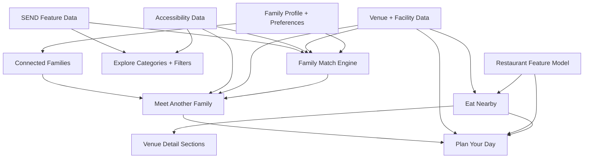

# FamilyPilot — Product Direction V2

> **Read [MASTER_PRODUCT_VISION.md](./MASTER_PRODUCT_VISION.md) first.**  
> That document is the product constitution. This file provides **detailed feature specifications** for planned work — it does not override the vision, simplify it, or replace it.

**Date:** 7 August 2026  
**Status:** Planning document — **not implemented**  
**Authority:** [MASTER_PRODUCT_VISION.md](./MASTER_PRODUCT_VISION.md)  
**Scope labels:** [MVP_SCOPE.md](./MVP_SCOPE.md) · [FUTURE_BACKLOG.md](./FUTURE_BACKLOG.md) · [FEATURE_ROADMAP.md](./FEATURE_ROADMAP.md)  
**Extends:** [PROJECT_STATUS.md](./PROJECT_STATUS.md) and [ARCHITECTURE.md](./ARCHITECTURE.md)

---

## 1. Updated FamilyPilot positioning

### What FamilyPilot is

**FamilyPilot is a personalised family decision engine.**

One family profile. Better decisions everywhere.

The app helps parents make practical, everyday decisions — not by replacing their judgement, but by reducing research and surfacing confident, explainable recommendations.

### What FamilyPilot is not

| FamilyPilot is NOT | Why |
|--------------------|-----|
| A day planner | Planning is one capability inside a broader decision platform |
| A booking site | We recommend; parents book elsewhere |
| An AI chatbot | Intelligence is invisible, embedded in scores and reasons |
| A parenting content app | No articles, feeds, or generic advice |
| A directory of places | Every listing is filtered and scored for *this* family |

### Positioning statement

> **The app that helps families make better everyday decisions.**

"Plan Your Day" is an important feature — one part of the FamilyPilot ecosystem — not the product identity.

---

## 2. Core family decision philosophy

### The decision test

Before building any feature, ask:

**What family decision does this feature help the parent make?**

If the answer is unclear, the feature should not be prioritised.

### Decisions FamilyPilot helps with

| Domain | Example decisions |
|--------|-------------------|
| **Outings** | What should we do today? Where suits our children's ages? |
| **Food** | Where should we eat afterwards? Is there a kids menu and baby changing? |
| **Social** | Where is fair for us and another family to meet? |
| **Accessibility** | Is this park step-free? Will my pushchair work here? |
| **SEND** | Does this venue offer sensory-friendly sessions? |
| **Essentials** | Where can I buy formula nearby? |
| **Travel prep** | What should we pack? Will this car fit our equipment? |
| **Holidays** | Which hotel suits our family? Should we hire a car? |
| **Products** | Which toys or products are suitable? (future) |

### Design principles

1. **One profile, many decisions** — Every feature reads from the same family profile and Family Match system.
2. **Explain, don't obscure** — Scores and recommendations must show *why*.
3. **Progressive profiling** — Ask for information only when relevant; never block onboarding.
4. **Honest data** — Never claim accessibility, SEND suitability, allergy safety, or live availability without verified sources.
5. **Parent stays in control** — Generated plans are starting points; parents can always swap, remove, or add stops.
6. **Do not overload Home** — New capabilities enter through contextual entry points, not headline repositioning.

### Final principle

FamilyPilot should not try to make every decision for the user. It should reduce research and provide confident, explainable recommendations.

---

## 3. Plan Your Day — specification

### Purpose

Help parents answer: **"What should we do today (or this Saturday)?"**

Builds a suggested family itinerary from profile, context, and venue data — integrated with restaurants and optional extras.

### Entry point

**Home → Plan something → Plan Your Day**

Not a primary tab. Not the app identity.

### Inputs

| Input | Source |
|-------|--------|
| Current location | Device / saved home area |
| Children's ages | Family profile |
| Family preferences | Profile (budget, interests, max drive) |
| Weather | Weather provider |
| Available time | User selection (e.g. "Saturday, 9am–3pm") |
| Budget | Profile tier + optional override |
| Maximum travel time | Profile |
| Pushchair needs | Profile / equipment |
| Accessibility requirements | Profile preferences (when set) |
| SEND preferences | Profile preferences (when set) |
| Saved places | Saved store |
| Family interests | Profile |

### Example output

```
Saturday Plan

10:00 — Aldenham Country Park
  • 96% Family Match
  • 14 minutes away
  • Pushchair friendly · Playground (ages 2–6)
  • Café · Baby changing
  • Estimated cost £18

12:15 — Lunch nearby
  • Family-friendly restaurant
  • Kids menu · High chairs · Baby changing
  • 3-minute drive

13:45 — Optional extra activity
  • Ice cream · Short walk · Small play area

14:30 — Home

Summary
  • Total estimated cost: £45
  • Total driving time: 38 min
  • Total outing duration: 5h 30m
  • Weather suitability: Good for outdoors
  • Why this plan suits your family: [3 reasons]
```

### User actions

- Accept the plan (save to Trips)
- Swap an activity (pick alternative from ranked list)
- Remove a stop
- Add another stop (from Explore / Saved)
- Save the plan
- Share the plan (summary text + link; no account required for recipient)

### Builder logic (MVP)

No complex route optimisation in v1.

1. Select primary activity (highest Family Match for context).
2. Estimate activity duration.
3. Find suitable restaurant within reasonable travel radius (**Eat Nearby** — see §7).
4. Optionally add second activity if time and energy allow.
5. Estimate return time.
6. Calculate total cost and travel.

Parents can modify every step. Copy must never imply the generated itinerary is the only option.

### MVP scope

- Mock/service-layer itinerary generation
- Manual swap/remove/add
- Save to existing Trips model
- Share as text summary (deep link to shared plan — future)

### Future scope

- Real-time traffic
- Nap-time awareness
- Multi-day plans
- Calendar export

---

## 4. Family Meetups — specification

### Feature name

**Meet Another Family**

### Purpose

Help two families answer: **"Where is a fair, practical place for us to meet?"**

The goal is not geographic midpoint alone — it is **balanced travel fairness + family suitability**.

### Method A — Simple one-phone mode (MVP)

Single device. No connected accounts required.

**Inputs:**

- Family A postcode / general area
- Family B postcode / general area
- Ages of children in both families
- Optional: accessibility / SEND / dietary flags (per session)

**Recommendation balances:**

| Factor | Weight (conceptual) |
|--------|---------------------|
| Drive time — Family A | High |
| Drive time — Family B | High |
| Travel time difference (fairness) | High |
| Children's ages (both families) | High |
| Facilities (toilets, café, parking) | Medium |
| Accessibility match | Medium (when required) |
| SEND suitability | Medium (when required) |
| Budget | Medium |
| Weather | Medium |
| Activity type | Medium |
| Restaurants nearby | Medium |

**Example output:**

```
Best place to meet — Willows Activity Farm

Travel
  • Your family: 27 min
  • Their family: 29 min
  • Travel difference: 2 min

Why it works
  • Suitable for ages 2–7
  • Pushchair friendly · Café · Toilets · Baby changing
  • Parking · Indoor backup
  • 95% combined Family Match

[2–3 alternatives below]
```

### Method B — Connected Family Mode (future)

Architecture prepared; not required for v1.

- Users invite grandparents, friends, cousins, other parents
- Each connected family has its own profile and preferences
- Combined recommendations consider all parties
- Requires: `family_connections` table, invite flow, consent model

### Sharing meetup plans

Shareable summary (no FamilyPilot account required to read):

- Venue name and map pin (approximate area)
- Date/time if selected
- Journey time for each family (not home addresses)
- Key facilities
- Combined Family Match + breakdown
- Restaurant suggestion
- Estimated cost

Future: browser-based shared plan page (`/share/meetup/{id}`).

---

## 5. Connected Families — future vision

### Purpose

Enable ongoing planning with trusted families without rebuilding profiles each time.

### Concepts

| Concept | Description |
|---------|-------------|
| **Connection** | Bidirectional or invite-accepted link between two family profiles |
| **Combined Match** | Score that reflects suitability for all connected parties |
| **Shared planning** | Meetups, day plans, and trip ideas that respect everyone's constraints |

### Example

```
Plan with the Smith family

Family A — Children 3 and 0 · Pushchair required · Max drive 30 min
Family B — Children 4 and 7 · Vegetarian dining · Max drive 35 min

→ Combined recommendations ranked by fairness + suitability
```

### Dependencies

- Auth and profile persistence (Phase 3)
- Privacy consent for sharing preferences
- Meet Another Family v1 validated by user testing

### Not in MVP

No social feed, no public profiles, no friend discovery.

---

## 6. Family-friendly restaurants — specification

### Purpose

Restaurants are a **first-class category**, not generic place results.

Help parents answer: **"Where can we eat with our children?"** and **"Where should we eat after this activity?"**

### Restaurant-specific attributes

Store and display when data exists:

| Category | Attributes |
|----------|------------|
| **Children** | Kids menu, high chairs, baby changing, colouring/activity packs, children eat free (verified only) |
| **Space** | Pushchair space, outdoor seating, speed of service |
| **Access** | Step-free access, accessible toilet, accessible seating |
| **SEND** | SEND-friendly environment, noise level indicator |
| **Dietary** | Vegetarian, vegan, gluten-free, allergy-friendly *(never claim allergy safety unless verified)* |
| **Practical** | Parking, booking recommended, estimated family spend, opening hours |

### Trust rules

- "Allergy-friendly" only with reliable, sourced data
- Offers (e.g. kids eat free) must be verified and dated
- Noise level uses factual descriptors (e.g. "typically lively") not judgment

### Integration points

- Explore category: **Restaurants**, **Cafés**
- Venue detail: **Eat nearby** section
- Plan Your Day: automatic lunch slot
- Meet Another Family: restaurant suggestion in share summary
- Family Match: restaurant-specific factor weights

---

## 7. Eat Nearby — specification

### Purpose

Whenever FamilyPilot recommends an activity, also answer: **"Where should we eat afterwards?"**

### Trigger surfaces

- Venue detail screen
- Plan Your Day builder
- Home / Explore activity cards (secondary CTA)
- Meet Another Family share summary

### Ranking inputs

| Input | Notes |
|-------|-------|
| Distance from activity | Primary |
| Family Match (restaurant) | Primary |
| Children's ages | From profile |
| Accessibility match | When required |
| Facilities | High chairs, changing, kids menu |
| Estimated cost | Budget fit |
| Opening hours | Must be open at expected meal time |
| Dietary preferences | From profile when set |

### Example (venue detail)

```
After Aldenham Country Park

Best nearby lunch — The Farmhouse Café
  • Family Match: 94%
  • 3 min drive
  • Kids menu · High chairs · Baby changing
  • Pushchair friendly
  • Estimated spend £35

Also consider: [2 alternatives]
```

### MVP

- Mock restaurant data linked to activity venues
- Rank by distance + Family Match + facility overlap
- Display on venue detail and in Plan Your Day

### Dependencies

- Restaurant feature model (§6) — **Priority 1**

---

## 8. Accessibility — specification

### Purpose

Accessibility is part of the **core venue model**, not a bolt-on filter.

Help parents answer: **"Can our family physically access and use this place?"**

### Venue attributes

Store with `verified`, `source`, and `updated_at` where possible.

| Category | Attributes |
|----------|------------|
| **Access** | Step-free access, wheelchair accessible, accessible entrances, lift availability |
| **Toilets** | Accessible toilet, Changing Places toilet |
| **Parking** | Accessible parking, disabled parking bays |
| **Paths (outdoor)** | Flat, mostly flat, mixed, hilly, very hilly |
| **Surface** | Path surface type, gradient / steepness |
| **Play** | Wheelchair-friendly playground equipment |
| **Seating** | Accessible seating (venue and restaurant) |
| **Carer** | Carer facilities, carer tickets |

Do not use vague "accessible" labels when detailed information is available.

### Profile preferences (progressive)

Optional requirements that affect Family Match:

- Step-free access required
- Wheelchair access required
- Accessible toilet required
- Changing Places required
- Flat terrain preferred
- Accessible parking required

**Behaviour:**

- **Required** preference not met → warn clearly or exclude (user setting)
- **Preferred** not met → lower Match score with explanation

### UI surfaces

- Explore filters (filter sheet — progressive disclosure)
- Venue detail: **Accessibility** section (only when data exists)
- Family Match factor: Accessibility
- Plan Your Day / Meetups: hard constraints when set

### Dependencies

- Extended venue schema — **Priority 2**

---

## 9. SEND-friendly — specification

### Purpose

Help parents find activities suitable for SEND needs using **factual attributes**, not unsupported diagnosis claims.

### Terminology

Prefer **SEND-friendly** over unclear shorthand.

Never claim suitability for a specific diagnosis unless supported by reliable venue information.

### Venue attributes

| Attribute | Example display |
|-----------|-----------------|
| Sensory-friendly session | "Sensory-friendly session: Sundays 9–10am" |
| Autism-friendly session | Scheduled times only |
| Reduced-noise session | Scheduled times only |
| Quiet areas | Factual |
| Sensory rooms | Factual |
| Low-light sessions | Scheduled times only |
| Visual schedules | Factual |
| Smaller group sessions | Factual |
| Ear defenders available | Factual |
| Staff trained in SEND support | Sourced claim only |
| Carer tickets | Factual |
| Accessible play equipment | Factual |
| Flexible entry times | Factual |
| Queue assistance | Factual |
| Changing Places | Link to accessibility |

### Profile preferences (progressive)

- SEND-friendly preferred
- Sensory-friendly sessions required/preferred
- Quiet environment preferred
- *(Ask only when user uses SEND filters or views SEND content)*

### UI surfaces

- Explore category: **SEND-friendly**
- Venue detail: **SEND information** section (when data exists)
- Family Match factor: SEND suitability
- Filters in Explore sheet

### Dependencies

- Extended venue schema — **Priority 3**
- Accessibility foundation helps (Changing Places overlap)

---

## 10. Family Match updates

### Current state (implemented)

Family Match considers age suitability, distance, budget, weather, facilities — with explainable reasons.

### V2 inputs (planned)

| Factor | Feature link |
|--------|--------------|
| Child age suitability | Core |
| Distance / travel time | Core |
| Budget fit | Core |
| Weather fit | Core |
| Facilities match | Core |
| **Accessibility match** | §8 |
| **SEND suitability** | §9 |
| **Restaurant proximity** | §7 (for activity venues) |
| **Family interests** | Profile |
| **Travel fairness** | §4 Meetups (combined score) |

### Combined Family Match (Meetups)

```
Combined Family Match — 96%

Breakdown
  • Family A suitability: 98%
  • Family B suitability: 94%
  • Travel fairness: 97%
  • Facilities: 95%
```

Reasoning must remain visible — never collapse to a single opaque number.

### Scoring implementation notes

- Extend `FamilyScoreFactors` type with new dimensions
- Weight required accessibility/SEND constraints as hard filters or heavy penalties
- Restaurant Match uses restaurant-specific factor set
- Combined Match uses weighted average with fairness floor (max travel delta threshold)

---

## 11. Data requirements

### New / extended entities (planned)

```sql
-- Accessibility (per venue)
accessibility_features (
  id, venue_id, feature_type, verified, source, updated_at
)

-- SEND (per venue)
send_features (
  id, venue_id, feature_type, schedule_details, verified, source, updated_at
)

-- Restaurant-specific (extends or links to venues)
restaurant_features (
  venue_id, kids_menu, high_chairs, baby_changing, pushchair_space,
  play_area, accessible_toilet, estimated_spend, noise_level, ...
)

-- Future: connected families
family_connections (
  id, family_a, family_b, status, created_at
)

-- Meetup plans
meetup_plans (
  id, creator_profile_id, family_a_location, family_b_location,
  selected_venue_id, planned_date, share_token, created_at
)

-- Day plans (extends trips)
day_plans (
  id, family_id, title, planned_date, stops JSONB,
  total_cost_estimate, total_drive_minutes, status, created_at
)
```

### Profile extensions (progressive)

```typescript
interface FamilyPreferences {
  accessibility?: AccessibilityRequirements;
  send?: SendPreferences;
  dining?: DiningPreferences;      // vegetarian, halal, etc.
  meetup?: MeetupPreferences;      // max fair travel delta
}
```

### Data sourcing strategy

| Data type | MVP | Production |
|-----------|-----|------------|
| Restaurants | Mock linked to activities | Places API + manual curation + parent contributions |
| Accessibility | Mock flags on key venues | Venue websites, AccessAble, parent verification |
| SEND sessions | Mock schedules | Venue timetables, charity listings |
| Travel times | Mock minutes | Maps provider |

### Implementation approach

- Prototype with mock/service layer (current pattern)
- Extend Supabase schema when auth lands (Phase 3)
- Do not build unnecessary backend complexity before user testing validates demand

---

## 12. Privacy considerations

### Location sensitivity

Exact home addresses are sensitive.

| Rule | Implementation |
|------|----------------|
| Meetups use postcodes/general areas | Geocode to centroid for routing; do not store full address in share payload |
| Shared plans show travel times, not origins | "Your family: 27 min" not "From WD6…" |
| Minimum data retention | Session/postcode for calculation; optional save to plan |
| Connected families | Explicit consent before sharing profile attributes |
| No public exposure | Another family's home never shown without permission |

### Share payloads

Safe to include: venue, times, travel duration per party, facilities, match scores, cost estimates.  
Never include: full postcodes, exact coordinates of homes, children's full names (unless user opts in).

---

## 13. Updated roadmap

### Current phase: Parent user testing

**Do not build V2 features until structured feedback is collected.**

Production build: https://family-pilot-seven.vercel.app/  
Guide: [PARENT_TESTING_GUIDE.md](./PARENT_TESTING_GUIDE.md)

### Post-feedback implementation order

| Priority | Feature | Rationale |
|----------|---------|-----------|
| **1** | Family-friendly restaurant data + **Eat Nearby** | Improves almost every activity recommendation |
| **2** | Accessibility fields + filters | Core venue information; affects Match and trust |
| **3** | SEND-friendly information + filters | High value, inclusivity, differentiated |
| **4** | **Meet Another Family** (one-phone mode) | Distinctive; depends on location + venue quality |
| **5** | **Plan Your Day** | Consumes restaurants, venues, weather, profile |
| **6** | Connected Families | Social/account complexity; validate demand first |

### What not to build before testing

- Connected Family accounts
- Complex route optimisation
- Social feeds
- Full backend for meetup sharing
- Booking integrations

---

## 14. Dependencies between features



**Critical path:** Restaurant data → Eat Nearby → Plan Your Day  
**Parallel track:** Accessibility → SEND → Explore filters  
**Independent after venues:** Meet Another Family (one-phone)

---

## 15. MVP versus future scope

| Feature | MVP (first ship) | Future |
|---------|------------------|--------|
| **Eat Nearby** | 2–3 mock restaurants per activity venue | Live hours, booking links |
| **Restaurants** | Curated mock attributes | Verified provider data |
| **Accessibility** | Key flags on mock venues; profile preferences | AccessAble integration, user reports |
| **SEND** | Factual session times on select venues | Expanded catalogue, filters |
| **Meet Another Family** | One-phone, two postcodes, share text | Connected families, web share page |
| **Plan Your Day** | Generated plan, swap/remove/add, save to Trips | Traffic, nap awareness, calendar |
| **Connected Families** | Schema only | Invites, combined planning |
| **Family Match** | Extended factors in mock scoring | Edge function, personalisation learning |
| **Home** | Plan something → sub-menu | No change to primary identity |
| **Explore** | New categories in filter sheet | Map pins with Match scores |

---

## UI integration summary (no Home overload)

### Home (keep current simplified structure)

Quick actions remain:

- Go outside
- Indoor ideas
- Need something now
- **Plan something** → sub-menu:
  - Plan Your Day
  - Meet Another Family
  - Plan a Trip (existing Trips)

Restaurants appear **contextually** (Eat Nearby, Explore), not as a dominant Home section.

### Explore (prepare)

Categories: Parks, Playgrounds, Attractions, Restaurants, Cafés, Soft play, Farms, Museums, Walks, Beaches, SEND-friendly, Accessible.

Filters via progressive-disclosure sheet — not all visible at once.

### Venue detail (prepare sections)

| Section | When shown |
|---------|------------|
| Family suitability | Always |
| Facilities | Always |
| Accessibility | When data exists |
| SEND information | When data exists |
| Eat nearby | When restaurants linked |
| Meet here | CTA for future meetup flow |

---

## Related documents

| Document | Purpose |
|----------|---------|
| [PROJECT_STATUS.md](./PROJECT_STATUS.md) | Current implementation status |
| [ARCHITECTURE.md](./ARCHITECTURE.md) | Technical architecture |
| [DESIGN_AUDIT.md](./DESIGN_AUDIT.md) | Pre-remediation quality audit |
| [PHASE_2_REMEDIATION.md](./PHASE_2_REMEDIATION.md) | Remediation + production QA |
| [PARENT_TESTING_GUIDE.md](./PARENT_TESTING_GUIDE.md) | Tester instructions |
| [BACKLOG.md](./BACKLOG.md) | Deferred items + V2 feature index |

---

*This document defines product direction only. No V2 features are marked as implemented until explicitly built and verified.*
